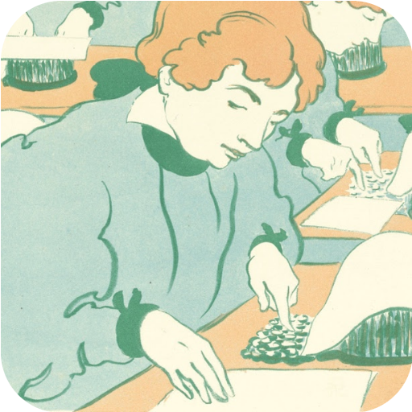

<p align="center">
  
</p>

<center><h1>typyst</h1></center>

<p align="center">
  <a href="#-what-it-is"></a>
  <a href="#-features"></a>
  <a href="#-building"></a>
  <a href="#%EF%B8%8F-configuring"></a>
  <a href="#%EF%B8%8F-license"></a>
  <a href="#-thanks"></a>
</p>

### 🧵 what it is

**typyst** is my personal terminal emulator, built on top of [suckless st](https://st.suckless.org/). It replaces Xlib for **SDL2** and **SDL2_ttf**, allowing smooth font rendering, true colour, translucency, and animated GIF backgrounds.

---

### ✨ features

- **SDL2 renderer** — making it easy to port to other platforms, i made it work on Linux and macOS
- **Optimised** — it hovers around 1-2% of cpu and gpu. I wrote a custom glyph cache and optmised 2 draw-calls renderer
- **GIF backgrounds** — any animated background you like to personalize your terminal and make it truly yours
- **Better Emojis and Unicode** — renders all emojis and unicode characters in a way that does not distrupt the layout of your terminal application.
- **Kitty keyboard protocol** — modern key reporting for your fancy editor keybindings.
- **suckless philosophy** — single-file config (`config.h`), recompile to customise. No bloat, no surprises.
- **24‑bit colour** — to make all text pretty

---

### 🔧 building

```sh
git clone https://github.com/you/typyst
cd typyst
make
```

You'll need `fontconfig`, `SDL2`, `SDL2_ttf` and `SDL2_gfx` development headers.

First time you need to also compile the terminfo:

```sh
tic -sx tic.info
```

Then run:

```sh
./_build/typyst
```

Or make a macOS app bundle:

```sh
make macos-app
```

---

### 🎛️ options

```
Usage: typyst [options] [-- command..]

Options:
  -f <string>     fontconfig font spec
  -p <fps>        target frame rate (default: 60)
  -a <path.gif>   animated gif background
  -t <alpha>      background transparency 0.0-1.0
  -s <0|1>        fullscreen (default: 0)
  -e              end of options, remaining args are command to run
```

If no command is given after the options, typyst launches your login shell.

---

### 💖 configuring

Everything lives in `src/config.h`. Change the font, the opacity, the keybindings — then `make` again. No JSON, YAML, or other config files.

```c
// your font, your way
static char *font = "Ubuntu Mono:pixelsize=18:antialias=true:autohint=true";
float alpha = 0.8;          // how much of the world shines through
static int winpad = 0;      // padding around your text
```

---

### ⚖️ license

Typyst is available under a **non-commercial license**.
You may use, copy, modify, and distribute this software for personal,
educational, or non-profit purposes. **Any commercial use by individuals or
organisations is not permitted**.

This project incorporates third-party components under their own terms:

| Component | License |
|---|---|
| st (st.c, st.h) | [MIT / X Consortium](./LICENSE.md#2-st--mit--x-consortium-license) |
| arg.h | Public Domain |
| gifdec | Public Domain |
| Icon artwork (Hermann-Paul, 1896) | Public Domain |

See [LICENSE.md](./LICENSE.md) for the full license text and
attribution details.

---

### 🌱 thanks

typyst wouldn't exist without the generous work of:

- The **suckless** community and st authors — [Hiltjo Posthuma](https://codemadness.org), [Devin J. Pohly](https://djpohly.dev), [Quentin Rameau](https://fifth.space), [Aurélien Aptel](https://aaptel.github.io), and all the [contributors](https://git.suckless.org/st/tree/LICENSE) who built the foundation
- **SDL2** and **SDL_ttf** — for making cross-platform rendering a joy
- **gifdec** — for bringing life to typyst's backgroundss
- **[Hermann-Paul](https://www.vangoghmuseum.nl/en/collection/p1243V2000)** — for creating the 1896 lithograph *Little Typewriters* (*Les petites machines à écrire*)

---

<p align="center">
  <sub>
    header image: <em>Little Typewriters (Les petites machines à écrire)</em> — 
    <a href="https://www.vangoghmuseum.nl/en/collection/p1243V2000">Hermann-Paul, 1896</a>.
    Van Gogh Museum, Amsterdam (Vincent van Gogh Foundation).
    Used with gratitude.
  </sub>
</p>
